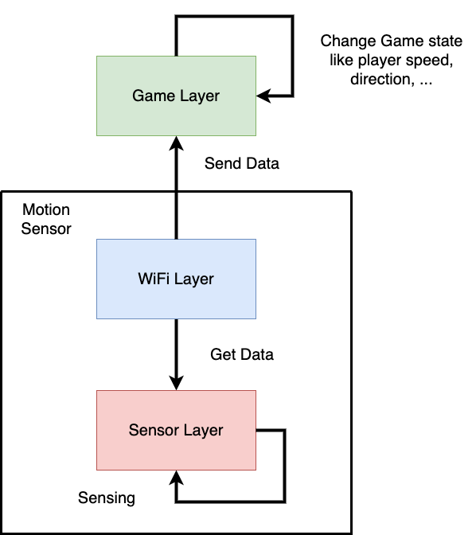
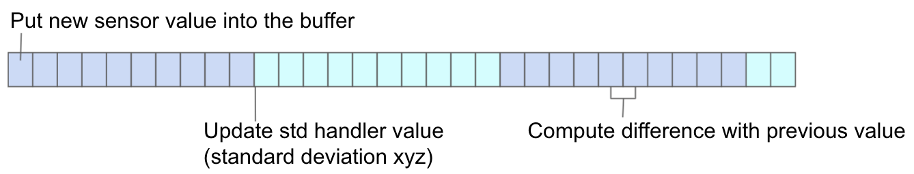
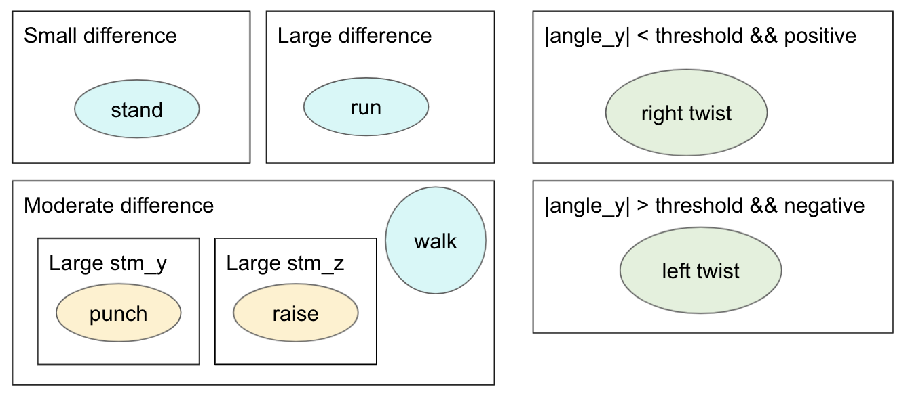
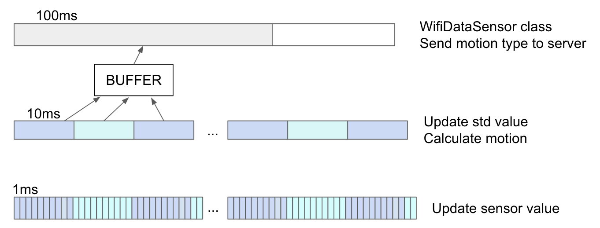

**2021 Spring ESLab Final Project - Motion**
===

**Authors**:
- 陳映樵 B07901
- 吳宜庭 B07901095

## Outline
- [Abstract](#abstract)
- [Motivation](#motivation)
- [Implementation](#implementation)
    + [I. System Architecture](#i-system-architecture)
    + [II. System Layering](#ii-system-layering)
      * [1. Data Layer](#1-data-layer)
      * [2. Wifi Layer](#2-wifi-layer)
      * [3. Game Layer](#3-game-layer)
    + [III. Motion Detection](#iii-motion-detection)
      * [1. Data Collection](#1-data-collection)
      * [2. Motion Identification](#2-motion-identification)
    + [IV. Location Service](#iv-location-service)
    + [V. Game Design](#v-game-design)
- [Achievements](#achievements)
- [Setup & Usage](#setup--usage)
- [Progress](#progress)
- [Demo](#demo)
- [References](#references)


## Abstract
In this project, we have created an archaic treasure hunting game played with motion control. We integrated several sensors in STM32 board with our own motion detection algorithm, object class wrapper and multi-threading technique for realization.

## Motivation
We started from the idea of building a reality game in which players can trigger different tasks based on their locations and complete the tasks by performing specified movements. We thought controlling the game by motion rather than pressing buttons would add more fun to the user experience, and combining location service with motion service could serve for wider purposes in the future. We also aimed at refining the codes in previous works as well as adding the detection for more wide-ranged motions. In the end, we achieved code refinement and motion control. However, the location service was omitted due to some hardware issues.


## Implementation

### I. System Architecture


### II. System Layering

#### 1. Data Layer

#### 2. WiFi Layer
We implement a wifi wrapper class over the data sensor, which will get motion type from the sensor on a certain interval, then send this information to the game server.

#### 3. Game Layer
We write out game program based on a spaceship shooting game from the web. The player have to move around the screen to find the treasure. If the player collides with asteroids, the player lose the game. If the player collect all treasures, it wins.


### III. Motion Detection

#### 1. Data Collection

**Calibration**

Right after the `DataSensor::start()`, we call `calibration()` to collect the first 1000 sensor data samples within a second. We take the mean of these samples as the offsets. All the following sensor values will be subtracted by the offsets.

**Sliding Window**

To avoid glitches in the raw data, we used a sliding window technique to acquire the data. For the accelerometer, we recorded the sensor data every 1 ms and store it in a buffer of size 10. We calculated the standard deviation of 10 consecutive buffer values every 10 ms. Larger standard deviation means that there is more motion in that direction. In the meantime, we also calculated the difference of sensor value each millisecond compared to the previous millisecond. This allowed us to easily differentiate between motions of different frequencies. The amplitude value was also recorded.
+ `stm_x/stm_y/stm_z`: Standard deviation values every 10 ms.
+ `stm_diff`: Amplitude difference between milliseconds.
+ `stm_all`: Amplitude of each milliseconds.



As for the gyroscope, we used Riemann sum in place of integration to convert the angular velocity to angles.
   ```
     angle[i] += (pGyroDataXYZ[i] + pGyroDataXYZ_prev[i]) / 2 * STD_TIMESTEP * SCALE_MULTIPLIER * 0.001
   ```
Like the accelerometer, we kept the difference of angles compared to the previous millisecond in a buffer and calculated its standard deviation every 10 ms (`stm_angle`).

#### 2. Motion Identification

**Preliminary Motions**

In this project, seven motion types are identified: `Stand`, `Walk`, `Run`, `Left twist`, `Right twist`, `Punch` and `Raise hand`.



The difference `stm_diff` serves as an index to distinguish between motions of different frequencies. The smallest value corresponds to standing, while the largest value is further evaluated for its continual time period -- if the value exceeds a threshold for a longer period of time, we classified it as running. For the rest of the movements, we looked at its `stm_y` and `stm_z` for its main axis of activity. Motions with a larger `stm_y` resembles punching, those with a larger `stm_z` resembles raising hands, and those with moderate values in both directions resembles walking.
As for wrist twisting, we looked at the absolute value of `stm_angle` in the y direction, since this value is dominant only in the wrist twisting movements. The sign of such value helps us decide the direction of twists.

**Motion Refinement**

After acquiring the motion types with above algorithm, we found that there were some glitches while we were performing the same movement. To eliminate such inconsistency, we added another window similar than that mentioned in the sliding window technique. The preliminary motions are computed every 10 ms and stored in a buffer. Every 100 ms, a final motion type is generated from the past 10 buffer values. This way, the motion types are more consecutive, and the data transmission rate is also closer to what is desired.



### IV. Location Service

### V. Game Design


## Setup & Usage

### Setup on Mbed compiler
- Configure the Wi-Fi shield to use.

   Edit `mbed_app.json` to include the correct Wi-Fi shield, SSID and password. In our example, `wifi-shield`is "WIFI_ISM43362". Notice that STM32 usually support only 802.11g, so you may have to check your wifi configuration.

   ```
       "config": {
            "wifi-shield": {
                    "help": "Options are WIFI_IDW0XX1",
                    "value": "WIFI_IDW0XX1"
                    },
            "wifi-ssid": {
                "help": "WiFi SSID",
                "value": "\"SSID\""
            },
            "wifi-password": {
                "help": "WiFi Password",
                "value": "\"Password\""
            }
       }
   ```

- Import Sensor library `BSP_B-L475E-IOT01` and `wifi-ism43362`. There is a button under the bottom right corner of the screen.

### Setup for the game
- If you have not installed pygame previously, run `pip install -r requirements.txt` under `game/project`.

### Starting the game
1. Under `game/project`, run `python treasure-hunt`.
2. Make sure STM32 board is held in right hand with hand vertical to ground and press the restart button.
3. The pygame window will automatically pops up when the wifi connection is successfully established.
4. Game instructions:
   * Eat the two treasures and avoid getting hit by aesteroids.
   * Stand: remain in the same spot.
   * Walk: move forward.
   * Right twist: turn right.
   * Run: fire.
   * Raise hand: accelerate.

## Achievements
In the previous works, either motions that vary greatly on the frequencies (eg. walking versus running) or those limited to a smaller frame (eg. tilting the boards in different directions) are detected. For the full-body motions, several sensors were connected to different body parts. However, in our project, we managed to detect both confined movements (eg. wrist twisting) and wide-ranged motions of various directions (eg. raising hands and punching) by using only a single accelerometer and gyroscope. Though the precision can be improved, our project has brought about the possibility of detecting a greater amount of motions in a more user-friendly setting.

## Progress
- [Proposal](https://docs.google.com/presentation/d/1zUISQAgCSKkXEW6G_4c_JL1AxVgvxVhpq2gYIAT18C8/edit?usp=sharing)
- [Progress Report](https://docs.google.com/presentation/d/1QpmcDUexZokhLhzRx4198VfW1-WgqPi4YffoX4_mxNY/edit?usp=sharing)

## Demo
### Final Project Demo
[](http://www.youtube.com/watch?v=kcvfzlNczBo "Final Demo")

## References
- [2019-STM Fit](https://github.com/NTUEE-ESLab/ESYS_2019) (NTUEE-ESLab Project) 
